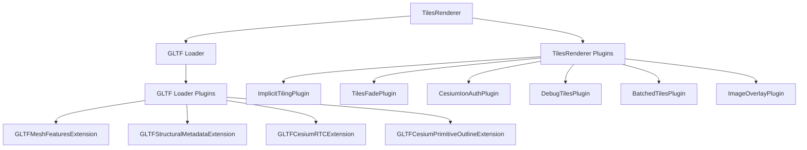
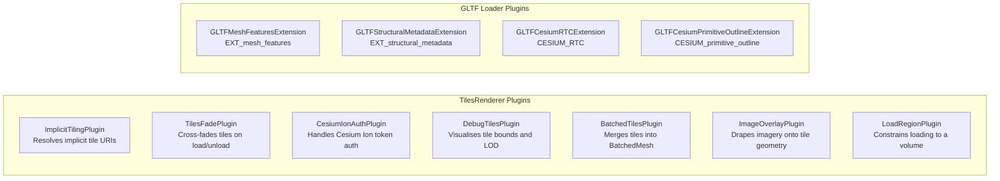

# 3DTilesRendererJS: The Plugin System

## Introduction

[3DTilesRendererJS](https://github.com/NASA-AMMOS/3DTilesRendererJS) is a JavaScript library for loading and rendering [3D Tiles](https://docs.ogc.org/cs/22-025r4/22-025r4.html) data in the browser. Developed by NASA AMMOS, it handles the full lifecycle of 3D Tiles: network requests, tile prioritisation, level-of-detail selection, and scene graph management. The library is built on [Three.js](https://threejs.org/) and integrates directly with Three.js scenes.

3D Tiles is an open specification from the Open Geospatial Consortium for streaming massive heterogeneous 3D geospatial datasets — buildings, terrain, pointclouds, and photogrammetry — over the web. The specification defines how data is organised into a spatial hierarchy of tiles and how each tile's payload is encoded.

3DTilesRendererJS is the implementation that brings this specification to the web browser, and it does so in a way that makes extending behaviour straightforward: through a plugin system.

---

## Where 3DTilesRendererJS is Used

The library has been adopted in a range of web mapping and visualisation contexts.

**MapLibre GL JS** is a popular open-source web map library. Because MapLibre supports custom Three.js rendering layers (`renderingMode: '3d'`), 3DTilesRendererJS can render 3D Tiles directly on top of a vector tile base map. The renderer uses the shared WebGL context, so 3D buildings align with the 2D map underneath. This combination is used in the sample viewer in this repository.

**BabylonJS** is a game-oriented 3D engine. The `3d-tiles-renderer` package has a BabylonJS adapter that wraps the core rendering logic. Developers who have existing BabylonJS scenes can load 3D Tiles into them without switching rendering engines.

**Cesium Ion** content can be streamed through the library using the `CesiumIonAuthPlugin`. This means assets hosted on Cesium Ion — terrain, photogrammetry, city models — become accessible from any Three.js application, not only from CesiumJS.

**Giro3D** uses 3DTilesRendererJS internally to handle 3D Tiles layers. Giro3D is a GIS-focused visualisation library built on Three.js that supports local coordinate reference systems, which is useful for Dutch datasets that use the RD New projection.

In all these cases, the core rendering logic is the same. Only the outer integration layer changes.

---

## The Plugin System

The library exposes two plugin surfaces: one for the `TilesRenderer` itself, and one for the GLTF loader that parses the tile content.



### TilesRenderer Plugins

These are registered on the `TilesRenderer` instance. They modify how tiles are loaded, prioritised, rendered, and disposed. They receive lifecycle events from the renderer.

```js
const tiles = new TilesRenderer( url );
tiles.registerPlugin( new ImplicitTilingPlugin() );
tiles.registerPlugin( new TilesFadePlugin() );
```

### GLTF Loader Plugins

Each 3D Tiles tile typically contains a glTF binary (`.glb`) payload. Three.js includes a `GLTFLoader` for this format, and that loader accepts plugins that intercept the parsing process. These plugins follow the standard [Three.js GLTFLoader plugin API](https://threejs.org/docs/#examples/en/loaders/GLTFLoader).

```js
const loader = new GLTFLoader( tiles.manager );
loader.register( () => new GLTFMeshFeaturesExtension() );
tiles.manager.addHandler( /(gltf|glb)$/g, loader );
```

The `register` method takes a factory function. That factory is called once per glTF file that gets parsed. Each call creates a fresh plugin instance bound to the current `GLTFParser`. This is important: the parser holds all state for a single file, and the plugin needs access to it.

---

## Existing Plugins



**ImplicitTilingPlugin** — 3D Tiles 1.1 introduced implicit tiling, where tile addresses are derived from a regular grid rather than a full tileset JSON tree. Without this plugin, the renderer would request the template string literally. The plugin resolves level/x/y coordinates into actual file paths.

**TilesFadePlugin** — When a new tile loads, this plugin cross-fades the old and new geometry instead of swapping immediately. The result is smoother visual transitions when the camera moves and the level of detail changes.

**CesiumIonAuthPlugin** — Cesium Ion uses token-based authentication. This plugin handles token refresh and resolves the actual data URL from Ion's asset endpoint.

**DebugTilesPlugin** — Colours tiles by their bounding volume or level-of-detail level and draws wireframe outlines around the bounds. Useful when diagnosing why specific tiles do or do not load.

**BatchedTilesPlugin** — Combines individual tile geometries into Three.js `BatchedMesh`, which reduces the number of GPU draw calls and can improve rendering throughput for large datasets.

**ImageOverlayPlugin** — Projects 2D imagery (XYZ, WMS, WMTS, Google Maps, Cesium Ion) onto the surface of 3D tile geometry. This is used to drape satellite or map imagery over terrain or building models.

**LoadRegionPlugin** — Restricts tile loading to a specific spatial volume (sphere, OBB, or ray). Tiles outside the region are not loaded, which is useful when only a small area of a large tileset is needed.

**GLTFMeshFeaturesExtension** — Parses the `EXT_mesh_features` glTF extension, which maps per-vertex or per-texel data to feature IDs. Used in combination with structural metadata to associate properties with individual features (e.g. a building ID).

**GLTFStructuralMetadataExtension** — Parses the `EXT_structural_metadata` extension, which stores property tables with typed attribute data. Combined with mesh features, this enables attribute queries: click a building, look up its ID, area, year of construction.

**GLTFCesiumRTCExtension** — Handles the legacy `CESIUM_RTC` extension, which stores a Relative-to-Center translation in glTF files. Without this, models generated by older Cesium tools would appear at the wrong position.

---

## Writing a Custom Plugin

To illustrate what building a plugin looks like in practice, this section walks through `GLTFCesiumPrimitiveOutlineExtension`, a plugin that renders building outlines from 3D Tiles generated with [pg2b3dm](https://github.com/Geodan/pg2b3dm).

### The CESIUM_primitive_outline Extension

3D Tiles generated with pg2b3dm's `--add_outlines true` flag embed an extra accessor in each glTF primitive:

```json
"extensions": {
  "CESIUM_primitive_outline": {
    "indices": 4
  }
}
```

Accessor 4 contains pairs of vertex indices. Each pair marks the two endpoints of an edge that should be drawn as a line. The key challenge is rendering these lines without depth-fighting against the solid triangle faces.

### Plugin Structure

A GLTF loader plugin is an object with a `name` property and hook methods. The `afterRoot` hook is called once the full glTF file has been parsed and returns a promise that Three.js awaits before delivering the result to the caller.

```js
export class GLTFCesiumPrimitiveOutlineExtension {

  constructor( parser, options = {} ) {
    this.parser = parser;        // store parser for use in afterRoot
    this.name = 'CESIUM_primitive_outline';
    this.showOutline = options.showOutline !== false;
    // ... create or accept material
  }

  async afterRoot( gltf ) {
    if ( ! this.showOutline ) return;
    // ... process meshes
  }

}
```

### Finding the Right Meshes

Three.js r154 added `parser.associations`, a `WeakMap` that maps each parsed Three.js object back to its position in the raw glTF JSON. This is what allows the plugin to connect a `THREE.Mesh` to the `primitives` entry that contains the outline extension.

```js
gltf.scene.traverse( object => {
  if ( ! object.isMesh ) return;

  const assoc = parser.associations?.get( object );
  if ( ! assoc ) return;

  const primDef = json.meshes[ assoc.meshes ]?.primitives?.[ assoc.primitives ];
  const ext = primDef?.extensions?.[ 'CESIUM_primitive_outline' ];
  if ( ! ext ) return;

  // ext.indices is the accessor index that holds the edge pairs
} );
```

### Loading the Accessor and Building the Geometry

`parser.loadAccessor` returns a promise that resolves to a `THREE.BufferAttribute` containing the edge index data (pairs of `UNSIGNED_SHORT` or `UNSIGNED_INT` values).

```js
const indicesAttr = await parser.loadAccessor( ext.indices );

const lineGeom = new THREE.BufferGeometry();
lineGeom.setAttribute( 'position', object.geometry.attributes.position );
lineGeom.setIndex( indicesAttr );

const lines = new THREE.LineSegments( lineGeom, material );
lines.matrixAutoUpdate = false;
object.add( lines );
```

The line geometry shares the position buffer with the parent mesh geometry. Because the `LineSegments` is a child of the mesh, it is automatically removed from the scene when the tile is unloaded.

### Preventing Depth-Fighting

Rendering lines on top of triangle faces without a z-fighting artefact requires pushing the line vertices slightly toward the camera. A perspective-correct bias achieves this without scale distortion:

```glsl
vec4 clip = projectionMatrix * modelViewMatrix * vec4( position, 1.0 );
clip.z -= 0.0002 * clip.w;
gl_Position = clip;
```

`clip.w` is the view-space depth. Multiplying the bias by it keeps the offset proportional to distance, so the lines look consistent from any viewing distance.

### Registration

The factory pattern used by Three.js `GLTFLoader.register` allows options to be shared across all tile files while each file gets its own parser:

```js
const outlineOptions = { showOutline: true, outlineColor: 0x000000 };

loader.register( parser => new GLTFCesiumPrimitiveOutlineExtension( parser, outlineOptions ) );
```

The lambda is called once per glTF file. The `outlineOptions` object is captured by the closure and reused. If a shared material is passed through `outlineOptions.outlineMaterial`, all tiles use the same material instance, which reduces GPU state changes.

---

## The Value of a Plugin System

The `TilesRenderer` core handles a well-defined problem: schedule, fetch, parse, and render tiles at the right level of detail. Everything else is optional behaviour.

Without a plugin system, adding features like authentication, fade transitions, imagery overlays, or outline rendering would require forking the library or patching it. With a plugin system, each concern is isolated. Adding `CesiumIonAuthPlugin` does not affect fade behaviour. Adding `TilesFadePlugin` does not affect metadata parsing. Features compose without interference.

The GLTF loader plugin surface opens an additional dimension: the raw bytes of each tile's content become accessible. Any encoding that a glTF extension can express — outline edges, structural metadata, instanced meshes, custom materials — can be interpreted and rendered by a plugin that nobody on the core team anticipated.

This is where the approach becomes useful beyond the standard use cases. A team building a wind-turbine inspection tool might add a plugin that reads custom blade-condition metadata. A mapping platform might add a plugin that recolours buildings by energy label at load time. A developer working with Dutch BAG data might add outline rendering from edges pre-computed by pg2b3dm. None of these were designed into the library. The plugin system made them straightforward to add.

### Publishing a Plugin as an npm Package

A plugin is a plain JavaScript module. No build step is required if you target modern browsers or Node.js 18+. The plugin in this repository (`GLTFCesiumPrimitiveOutlineExtension`) is published as a standalone npm package:

```json
{
  "name": "3dtilesrenderer-outline-plugin",
  "type": "module",
  "main": "./src/GLTFCesiumPrimitiveOutlineExtension.js",
  "peerDependencies": {
    "three": ">=0.154.0"
  }
}
```

Three.js is a peer dependency, not a bundled one. This avoids shipping duplicate Three.js code when the consuming application already has it.

```
npm publish --access public
```

Anyone installing the package can register the plugin with three lines of code.

---

## Generating Outlined 3D Tiles

The [pg2b3dm](https://github.com/Geodan/pg2b3dm) tool converts PostGIS geometry to 3D Tiles. The `--add_outlines true` flag pre-computes the edge pairs and embeds them in the output.

```bash
pg2b3dm \
  -h localhost \
  -d postgres \
  -U postgres \
  -p 5432 \
  -c geom \
  -t public.sibbe \
  -a identificatie \
  --keep_projection false \
  --add_outlines true
```

The edges are computed once during tile generation, not at render time. The plugin reads them and draws them. The computation cost is paid once, not per frame.

---

## Conclusion

3DTilesRendererJS separates the core tile management logic from the domain-specific behaviour that different applications need. The plugin system is the mechanism for that separation.

TilesRenderer plugins cover the tile lifecycle: authentication, LOD fading, spatial filtering, instanced rendering. GLTF loader plugins cover content interpretation: metadata, outline edges, custom encodings. Both surfaces follow conventions already established in Three.js, which means the learning curve is low for anyone already familiar with the ecosystem.

The sample viewer at [sample/sibbe/](../sample/sibbe/) combines several of these plugins — `ImplicitTilingPlugin`, `GLTFMeshFeaturesExtension`, `GLTFStructuralMetadataExtension`, and `GLTFCesiumPrimitiveOutlineExtension` — to produce a map that loads BAG buildings with black outlines, clickable attribute queries, and terrain. Each plugin does one thing and the result is their combination.

---

## References

- [3DTilesRendererJS](https://github.com/NASA-AMMOS/3DTilesRendererJS)
- [3DTilesRendererJS plugin API](https://github.com/NASA-AMMOS/3DTilesRendererJS/tree/master/src/three/plugins)
- [3D Tiles specification](https://docs.ogc.org/cs/22-025r4/22-025r4.html)
- [CESIUM_primitive_outline extension](https://github.com/KhronosGroup/glTF/blob/main/extensions/2.0/Vendor/CESIUM_primitive_outline/README.md)
- [pg2b3dm](https://github.com/Geodan/pg2b3dm)
- [Three.js GLTFLoader plugin API](https://threejs.org/docs/#examples/en/loaders/GLTFLoader)
- [MapLibre GL JS custom layer](https://maplibre.org/maplibre-gl-js/docs/API/interfaces/CustomLayerInterface/)
